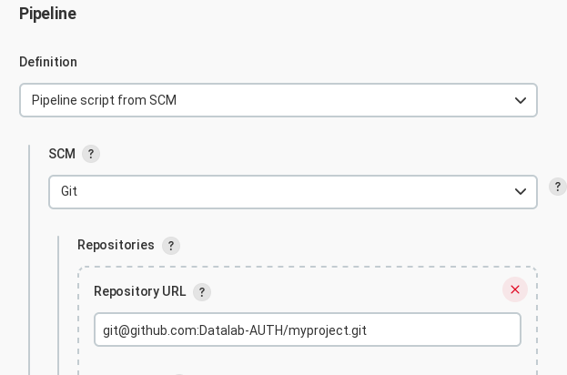

# How to CI/CD for Datalab

This tutorial explains how to use our Jenkins server for building a
docker image of your application and uploading our image to Dockerhub or
our private registry.

## Prerequisites

* a github repo with your app (preferably separate repos for different
  components, e.g. frontend and backend).
* your github repo includes a `Dockerfile` for building a docker image of your
  app.
* your github repo includes a `Jenkinsfile` in its root. See the sample file
  in this repository. Edit the variables in the *environment* section
  according to your needs. You can choose to upload the docker images that
  are built to DockerHub (if you want them to be public) or our own private
  registry (if you want them to be private).
  *NOTE: our own private registry is only accessible from AUTH IPs*
* if the github repo is private, your should either host it under the
  [Datalab-AUTH](https://github.com/orgs/Datalab-AUTH) organization or
  add the `datalabauth` user as a collaborator to your project.

## Add a Jenkins Job

Log into our [Jenkins instance](https://sdg1.csd.auth.gr/)
(ask around for credentials) and

* Click on "New Item"

* Give your job a distinctive name (e.g. "myproject-backend"), choose
  **Pipeline** and click the OK button.

* Optionally, provide a description for your job
* Select **Github project** and add your project's URL. It should be in
  form `https://github.com/Datalab-AUTH/myproject/`

* If you want to trigger building your image *at every git push you make*,
  under **Build Triggers** select
  **GitHub hook trigger for GITScm polling**. Careful with this, because
  if you run `git push` very often and your project takes a long time to
  build, you will create a large queue of images to build.
  *You also need to make some configuration changes to your Github project*.
  Instructions are below.

* Under **Pipeline/Definition** choose **Pipeline script from SCM**
* Under **Repository URL** add the URL to your repository in the form
  `git@github.com:Datalab-AUTH/myproject.git`
* If it is a private repo, under **Credentials** select
  **datalabauth (SSH keys used for the datalabauth Github account)**.
  If it is a public repo, you don't have to add any credentials.

* Make sure there are no errors in your configuration. If there is
  anything wrong with the git repo, Jenkis will show an error message in
  red.
* Under **Branches to build** in **Branch specifier** use `*/master` or
  `*/main` or whatever the name of the git branch you are going to push
  your changes is.

* Set **Script path** to `Jenkinsfile` if not already set

* Save the job configuration

In the main Jenkins page, your can manually trigger your job anytime you
want by hitting the respective "Play" button on the right.

## Github configuration

If you want to automatically run the Jenkins job at every `git push`
that you run, go to your Github project **Settings** and then under
**Webhooks** add a new one, set the **Payload URL** to
`https://sdg1.csd.auth.gr/github-webhook/`
**(make sure you add the trailing slash)**,
set **Content type** to *application/json* and finally make sure you
have **Just the push event** selected.

**NOTE:** It seems that you need to trigger the Jenkins job manually
once, for the webhook triggers to have any effect.

## Deployment

It is possible to have the VM that you have deployed your docker images
to, to check for new docker images at regular intervals using
[watchtower](https://containrrr.dev/watchtower/).

## Reports

All job reports, success or failures, are reported to the `#ci-cd`
channel in the Datalab slack workspace.

